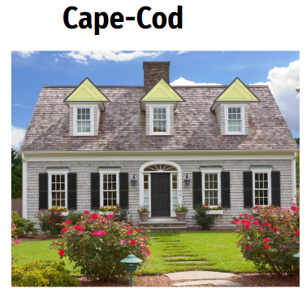
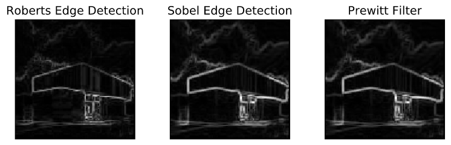
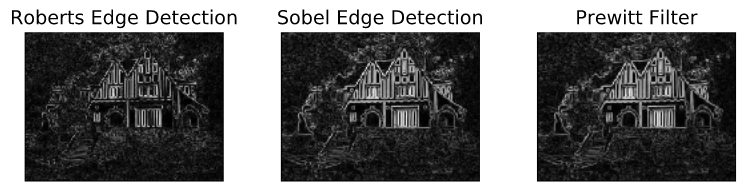
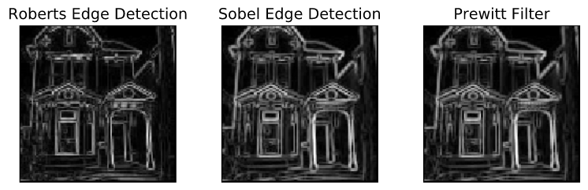
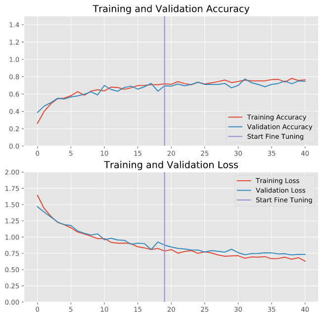
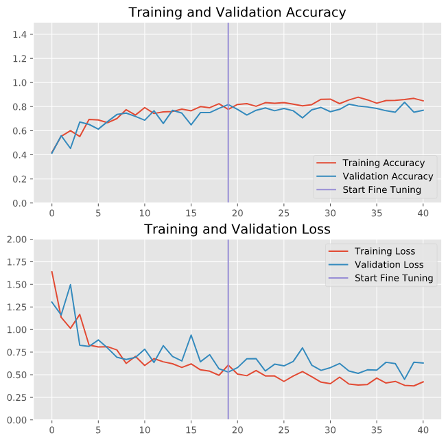
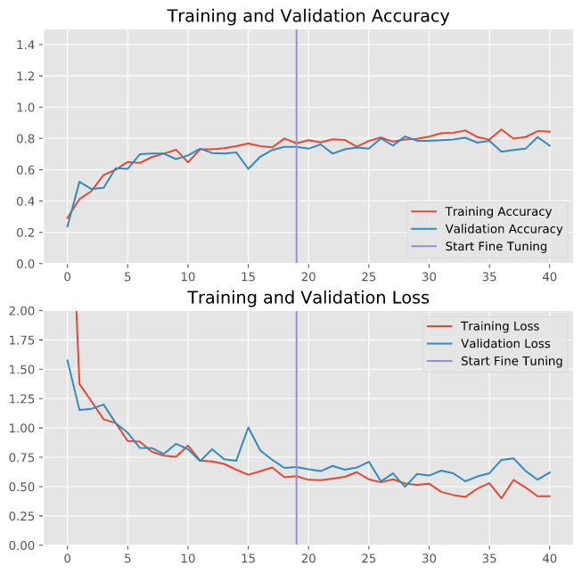
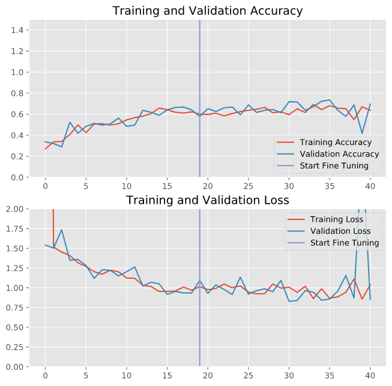

# Homestead-Obscurity
Using deep learning to classify home architecture

## Inspiration

  
  

Convolutional Neural Networks (CNNs) are especially good at processing images and featurizing their shapes, edges, curves, and depth. As I've learned more about CNNs and applied them throughout my work, I found myself wanting to look deeper at these networks while applying them to something I find personally interesting. Architecture is the perfect means with which to explore this deeper. I've been fortunate to have traveled many places all over the world and experienced a wide variety of cultures. While traveling, I was always drawn to the unique architectures associated with different cultures - and how they becuase the pride of each location. I chose to process images of different home architectural styles. My reasoning:
  1) There are many home architectures that have very distinguishing features
  2) There are many resources for home images
  
 ## Data
 | Architecture | Train Images | Test Images |
 |--------------|--------------|-------------|
 | Tudor | 508 | 40 |
 | Modern | 600 | 49 |
 | Victorian | 476 | 41 |
 | Ranch | 426 | 42 |
 | Modern | 500 | 40 |
 
 Sources: Zillow.com, google images, bing images, Pintrest
 

  
  
  

  
  

I've highlighted what I believe to be the most prominent and distinguishing features exhibited by the five home styles I selected. I sought out images that were fairly consistent with these features, and opted for the photos that most centrally displayed the homes. 

## Data Augmentation

My corpus of images is small, especially in the realm of neural network training. To prevent over-fitting, and introduce more variety for the model to train on, I applied an image augmentation protocol into my image processing pipline. The augmentation randomly zooms in, shifts along vertical and horizontal axis, randomly horizontal flips, and slightly rotates images. See example below.

  

## EDA
As I mentinoed, architecture is defined by its lines, shapes and edges. As such, edge recognition / detection is an important feature that will have to be extracted. Prior to running the images through the 'black box' of a CNN, I wanted to see if the prominence of the edges I identified in each image would indeed shine through with some basic edge detion. 

| Modern Home Edge Detection |
|----------------------------|
|  |

| Tudor Home Edge Detection |
|----------------------------|
|  | 

| Victorian Home Edge Detection |
|----------------------------|
|  | 

As expected, the prominent features of the home types above are evident in the edge detection filters. 

## CNNs

CNNS are widely regarded for thir ability to efficiently process images. In fact, they were originally modeled after how neurons in the visual cortex interact. Research by David H. Hubel and Torsten Wiesel in the late 1950s proved that neurons in the visual cortex have a small receptive field, and react only to specific shapes. Different neurons react to different shapes, and together they form the visual field. Their research also showed that some neurons react to more complex patterns, and that these patterns were combinations of the simpler shapes perceived by other neurons. 

  

 
In the above illustration, each individual filter will travel the entirety of the image, capturing the filters respective patterns and aggregating that information into what are called activation maps, or convolutions. A helpful analogy is to think about polarized sunglasses: only the light that is aligned with the orientation of the polarized lens reaches our eyes. These activation maps are then pooled, which is a downsizing operation. The pooling captures the strongest signals in the activation maps and then reduces the size of the convolution. At shallow depths, these activation maps capture simple shapes, lines, edges, etc. These are called 'spatial patterns'. In and of themselves, these spatial patterns don't provide a whole lot of insight. As we include more and more convolutional layers, however, these activation maps begin to capture more complex, or 'cross-channel' patterns. Keeping with the architecture analogy, shallow layers capture a sharp angle, line, or edge, and as we get deeper we begin to see a door, window, and house begin to form. After the pooling layer, we flatten out the information and connect it to our classifications - 5 in our case. 

## Transfer Learning
The true power of CNNs are most evident when we employ transfer-learning. With transfer learning, we utilize a pre-trained network and adjust it for our needs. There are many readily available models to choose from, but I was most interested in, and had the best success with the Xception architecture (Francois Chollet - 2016). This model is trained on 350 million images and around 17,000 classes, and heavily features seperable convolutional layers. While traditional convolutional layers use filters that try to simultaneously capture spatial and cross-channel patterns, seperable layers strongly assumes that the spatial and cross-channel patterns can be modeled seperately. 

  

 Once I loaded in the Xception network, I began adjusting the layers to meet the requirements of my project. This involved removing the final layer, replcing with a dense (fully connected) layer and softmax activation with five classifications (one for each home type), and freezing the remaining layers from being able to train. Every other layer was frozen becuase, as a pre-trained model, it already has all the learned shapes / lines / edges built in. Softmax activation converts the final output layer of the neural network into probabilities in classification scenarios. These probabilities tell us which classification the model picks, as well as the confidence with which the pick was made. 
 
 ## Transfer Learning + Fine Tuning
 After the minimal tweaking of the Xception model, I wanted to train the model to get a base line transfer learning accuracy. Below is a plot of the trainin and validation loss / accuracy. 
 
 

  

In 10 epochs, allowing no adjustment to the weights in all of the built in layers of Xception, the validation accuracy approached 80% accuracy, an extremely impressive result. The next step was to begin unfreezing some of the layers in Xception to allow the model to adjust it's parameters to better classify the categories required. I also adjusted the learning rate, which controls how aggresively the model is allowed to adjust the pre-trained components of the model. In general, smaller learning rates are recommended when fine tuning a transfer learning model to fight over-fitting. Below are the same plots, but I've added a line indicating when I allowed the model to unfreeze layers and begin adjusting the pre-trained Xception weights. 

| Learning Rate 0.00001 | Learning Rate 0.0001 |
| ----------------------|----------------------|
|  |  |

| Learning Rate 0.001 | Learning Rate 0.01 |
| ----------------------|----------------------|
|  |  |

There are some signs of over-fitting / confusion with the learning rate going down to 0.01. For this reason I opted to keep the learning rate at 0.001 - yielding the best results. 

## Transfer Learning Results
 

  

 
 A perfect confusion matrix would have all solid dark blue along the diagonal, so the model is performing exceptionally well. The best accuracy I was able to acheive was 84%.
 
 

  
  

 
 ## My Own CNN
 
 I knew full well that acheiving anything close to the success of transfer-learning would be nearly impossible in the scope of this assignment. However, my goal in this project is to peek into the black box and understand what an excellent model reveals in the images and what a basic model from scratch would reveal. The basic structure of my base CNN is as follows:
 

 

 
 ## Training
 
 I introduced the same image corpus to train my model, and the resulting accuracy was to be expected:
 

 

 
 
