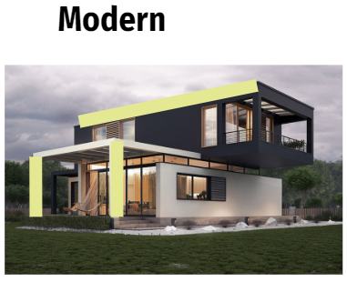
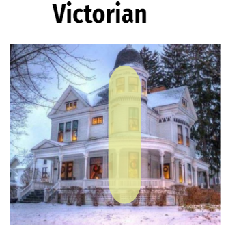
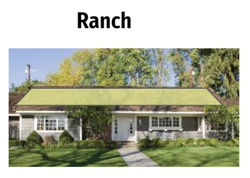

# Homeland-Obscurity
Using deep learning to classify home architecture

## Inspiration

  
  

Convolutional Neural Networks (CNNs) are especially good at processing images and featurizing their shapes, edges, curves, and depth. As I've learned more about CNNs and applied them throughout my work, I found myself wanting to look deeper at these networks while applying them to something I find personally interesting. Architecture is the perfect means with which to explore this deeper. I've been fortunate to have traveled many places all over the world and experienced a wide variety of cultures. While traveling, I was always drawn to the unique architectures associated with different cultures - and how they becuase the pride of each location. I chose to process images of different home architectural styles. My reasoning:
  1) There are many home architectures that have very distinguishing features
  2) There are many resources for home images
  
 ## Data
 | Architecture | Train Images | Test Images |
 |--------------|--------------|-------------|
 | Tudor | 508 | 40 |
 | Modern | 600 | 49 |
 | Victorian | 476 | 41 |
 | Ranch | 426 | 42 |
 | Modern | 500 | 40 |
 
 Sources: Zillow.com, google images, bing images, Pintrest
 
 

  
  
  
  
  

 
  
